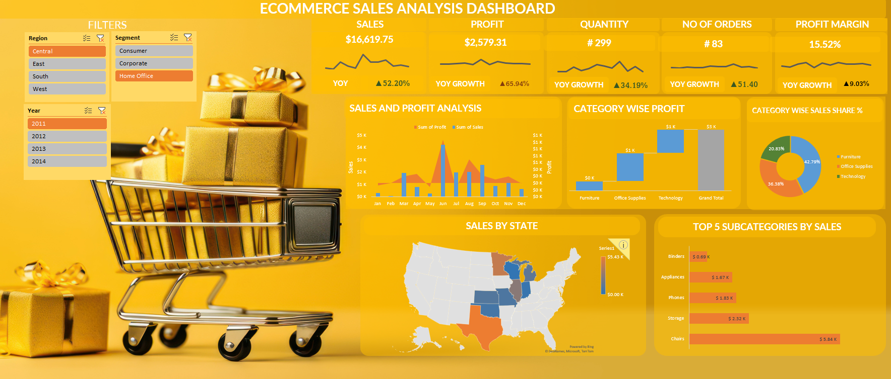

# 🚀 E-commerce Sales Analysis Dashboard

## 📝 Project Overview
Welcome to the **E-commerce Sales Analysis Dashboard**, an interactive and insightful project built using **Microsoft Excel**. The dashboard offers a comprehensive view of sales, profit trends, category performance, and customer segmentation over time.

This project emphasizes how Excel's advanced features can transform raw data into actionable business insights using **data cleaning**, **pivot tables**, **VBA automation**, and **visualization techniques**.

## 🔧 Tools & Technologies Used
- **Microsoft Excel:** For data analysis and dashboard creation.
- **Pivot Tables:** To dynamically filter and explore data across various dimensions (regions, segments, and years).
- **VBA Automation:** For speeding up repetitive tasks and enhancing productivity.
- **Data Cleaning:** Ensured that the dataset was properly structured and ready for accurate analysis.
- **Charts & Visualizations:** Built engaging visualizations to make the data trends easy to understand.

## 📊 Key Insights & Findings
Through the dashboard, we extracted valuable insights:
1. **Sales & Profit Growth:** 
   - 🚀 Sales saw a 29.82% YoY growth, while profit soared by 58.17%, indicating strong business momentum.
2. **Category Performance:** 
   - 💼 The **Technology** category led the profit contribution, followed by **Furniture** and **Office Supplies**.
3. **Regional Insights:** 
   - 📍 Sales were highest in the **Western** region, with other regions contributing significant revenue as well.
4. **Customer Segmentation:**
   - 🎯 Different customer segments (Consumer, Corporate, and Home Office) displayed varying purchasing behaviors, guiding tailored marketing strategies.

This dashboard allows users to:
- Filter data by **Year**, **Region**, and **Customer Segment** to observe trends.
- Analyze **Sales and Profit** month-over-month.
- Understand **Category-wise Profit** distribution and **Sales Share**.
- Visualize **Sales by State** and uncover regional performance patterns.
- Explore the **Top 5 Subcategories by Sales** for a more granular view.

